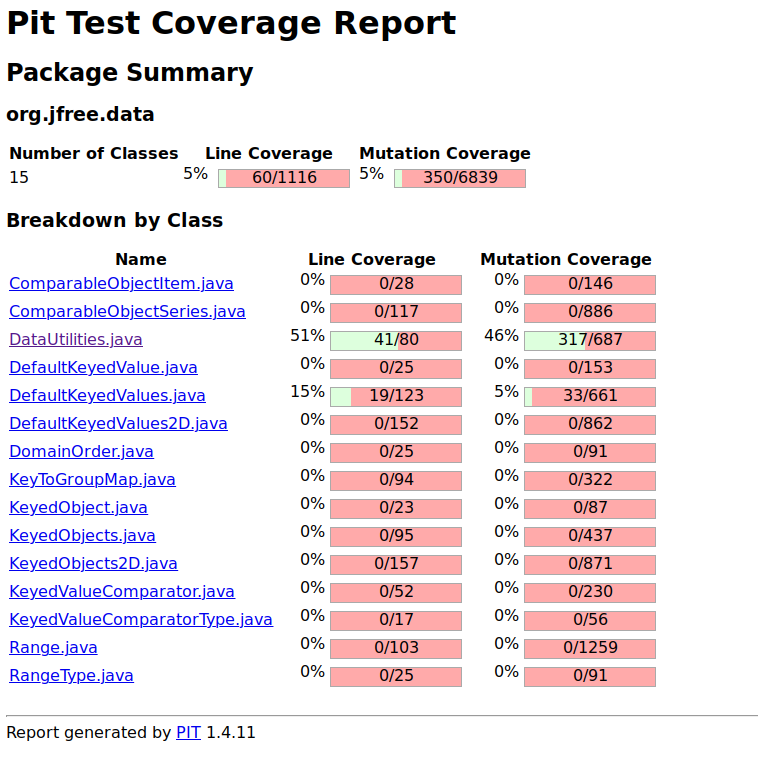
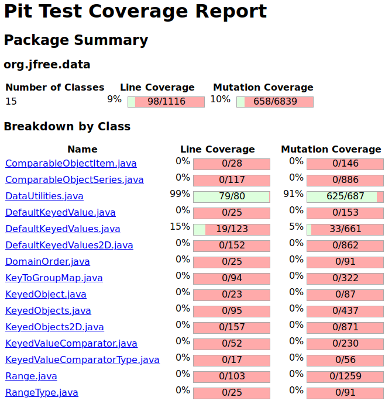
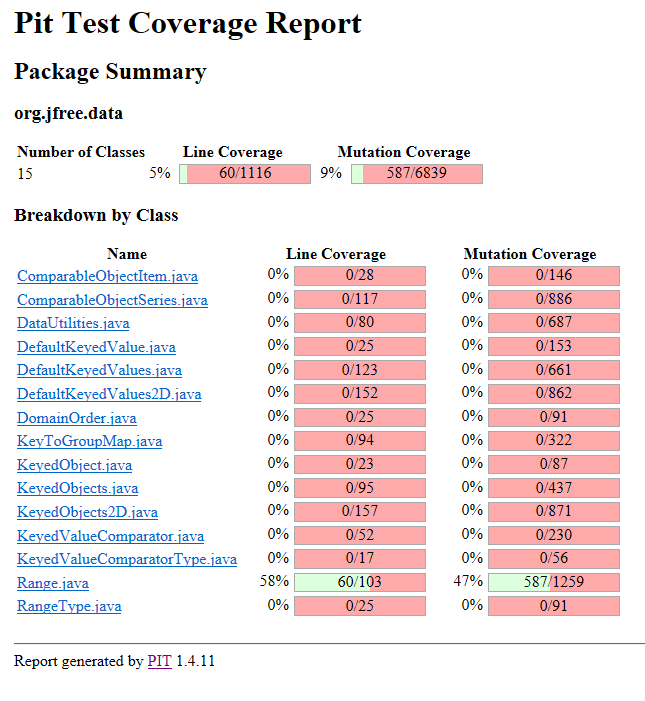
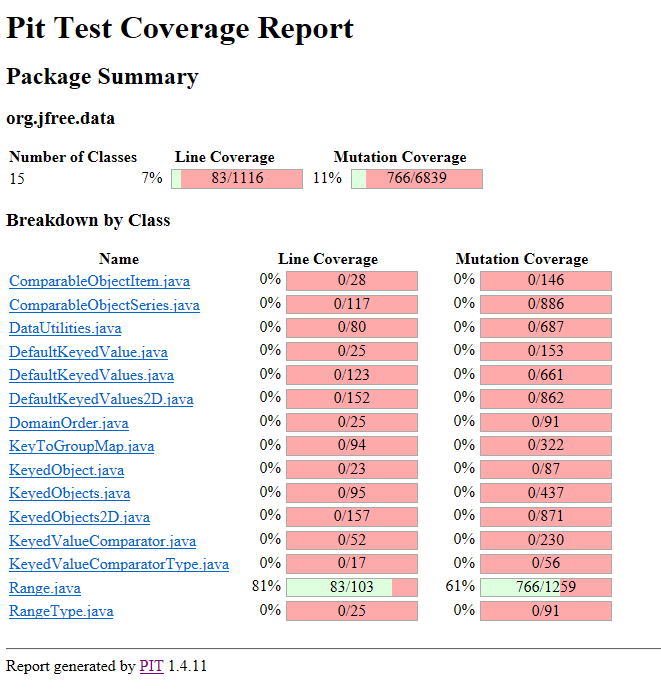

# **Lab. Report #3 – Mutation Testing and Web app testing **

**SENG 637 - Dependability and Reliability of Software Systems**

| Group \#:          | 34                  |
| ------------------ | ------------------- |
| **Student Names:** | Quinn Cooper        |
|                    | Mohd Akram Ansari   |
|                    | John Matthews Sarno |
|                    | Mahsa Malek         |

## 1. Analysis of 10 Mutants of the Range class

| Mutant                                                       | Description                                                  |
| ------------------------------------------------------------ | ------------------------------------------------------------ |
| **Replaced Operator**                                        | Typically, easy to kill, because if a value is 0 most operators are interchangeable. Typically killed by having random number or decimals. |
| **Negated conditional**                                      | Was frequently difficult to kill because the way methods were designed, they had failsafe's that would allow the method to still pass |
| **Removed condition**                                        | Similar situation to negated conditions                      |
| **Negated variables**                                        | Typically killed immediately as these changes the value of many variables significantly |
| **Removing/Adding the equal from less than equal/ greater than equal** | Another annoying thing to kill, but edge cases typically took care of it relatively simply |
| **Incremented variables**                                    | A bit tedious to kill, this was a frequent thorn in our side. Typically needed to be very exact with any tests so that they can’t possibly be off by an integer |
| **Removed call to class**                                    | Removed call for variable initializations, this typically was killed because this messes with the returned format. |
| **Substituting values**                                      | Typically, immediately killed                                |
| **Mutated return of object value**                           | This was rarely relevant but was immediately killed          |
| **Negated boolean return from method**                       | Super annoying to kill, for several methods was impossible due to makeup of the method |

## 2. Report all the statistics and the mutation score for each test class

#### DataUtlities: Mutation Coverage Before (46%)

#### DataUtilities: Mutation Coverage After (91%)

#### Range: Mutation Coverage Before (47%)

#### Range: Mutation Coverage After (61%)

## 3. Analysis drawn on the effectiveness of each of the test classes

**DataUtilitiesTest:** 

The mutation coverage was already pretty good for DataUtlities tests hence it was really challenging to find and fix mutants in the DataUtlities class. In the original tests 4 functions were not being tested: equal, clone, calculateColumnTotal (with validRows) and colculateRowTotal (with validCols). These impacted the coverage as well the mutation score of the original tests, but after increasing the coverage to include all functions, the mutation score increased to ~91%. Upon analysis we concluded that there were almost no more mutations to fix and most of the mutations left were equivalent mutations. Hence, we stopped increasing the mutation score at that point. 

**RangeTest:** 

The mutation coverage for range test started at 46% which was relatively low. It seemed partly responsible due to the line coverage, but ultimately it was due to how we initially designed many of our tests. Several of our range class values were pretty large length wise, whereas to find mutants having precise numbers worked best, especially when the length of a range was set to 1 or 0 max. 

 

## 4. A discussion on the effect of equivalent mutants on mutation score accuracy

Pretty much any value incremental is an equivalent mutant. Alongside most conditional negations or operator change. We found this by going through the PITest summary page and analysing what mutants were killed as we worked on increasing the coverage. Typically, whenever there is a change on the conditional it is a boolean operation, with the change of the operation (whatever that is) it will change that boolean result, thus giving us an equivalent mutant. This is similarly true with values within a conditional equivalent statement, any changes be they negative or positive that happen will simply a value from true to false or vice versa. 

When a mutant has gained the capability to keep the semantics unchanged, resulting to undetectability and impossibility to assess test suites using mutation testing, then it is most likely that equivalent mutants exist in the system. Since equivalent mutants act as false positives, the mutation score can be critically affected, and its accuracy suffers equivalently. What’s more painful is that these mutants are hard to detect and hence, very time-consuming. 

Due to the nature of mutants being highly dependent on the actual logic of the SUT, we had to find the equivalent mutants manually. There is no definitive way to find and eliminate equivalent mutants. The process that we followed was: 

1. Run the PIT mutations testing tool on the test class. 

1. Analyze mutations in the tested class using the PIT Summary generated by PITclipse. 

1. If the code that has been changed by the mutant does not affect any part of the logic, then it is an equivalent mutant. 

For example, PITclipse very frequently changed the condition of a for loop from less than (<) to not equal (!=). This change in loop condition does not affect when the loop stops in the logic in our SUT and hence does not affect the logic at all. This is considering the length of array is always > 0. 

From: `for(int I=0;I<array.length;I++) `

To: `for(int I=0;I!=array.length;I++)`

Some of the equivalent mutants that we found using this method are: 

1. **DataUtilities.equal** function (line 84) 
   From: `for (int i = 0; i < a.length; i++) `
   To:	for (int i = 0; i != a.length; i++) 
   This mutant does not affect the logic of the function. 

1. **DataUtlities.calculateColumnTotal** (lines 133) 
   From: `return total;`
   To: `return total++;`
   Here the value of total is incremented after it is returned hence the original value is returned having no effect on the output of the function. 

## 5. A discussion of what could have been done to improve the mutation score of the test suites

The mutations were purely dependent on the implementation of the SUT. Hence in order to improve the mutation score of our test suites, we went over the mutations from the PIT mutations report. We then found out exactly what mutations were not being detected by our tests. Once the mutations were detected, we figured out what test case (if any) is covering the logic which is being changed by the mutation. By trial and error we found out that a mutation went undetected mostly because of: 

- **Bad test logic:** The test under consideration does not work the way it is intended to. (I.e. wrong assertions/setup). These mutants were fixed by fixing the test logic. 
- **Logic not covered:** A lot of times the logic was not even covered by any of the tests. These mutants were caught by increasing coverage and adding new test cases. 
- **Generic assertion:** The value changed is not asserted in the test and hence never tested. These mutants were caught by adding assertions which check the returned value more precisely. 
- **Equivalent Mutation:** The mutation is not relevant and has no change on the logic of the code. These mutants cannot be caught since they do not change the behaviour of the SUT.  

**Some examples of how we fixed mutants are:** 

1. **CreateNumberArray (228)** Supplied cloned array instead of original array. The mutant was changing the input array and hence the assertion was matching with the changed array instead of the original array. 

1. **CreateNumberArray2D(244)** Asserted length of original and returned array. Returned array length was being modified by the mutant. 

1. **GetCumulativePercentages(267)** Since no null value was present in tested inputs, the check for v!=null was not being tested and hence never threw NullPointerException. By adding a null value, the mutation that removes the null value check raises a NullPointerException. 

## 6. Why do we need mutation testing? Advantages and disadvantages of mutation testing

Mutation testing is imperative in unit testing to determine the overall effectiveness and efficiency of test cases. By changing syntax in the source code, it is also able to identify whether the test suites by themselves can characterize bugs. Overall, due to its tedious checking, it is guaranteed that a customer will receive a system of superior quality. Although the benefits of mutation testing are undeniably great, it also comes with a few disadvantages, both of which are described below: 

**Advantages:** 

1. After mutation testing, the system is expected to become more stable and reliable. 
2. Ability to detect faulty test cases. 
3. Mutation testing also has the capability to achieve high coverage for the test cases. 
4. Certain loopholes in the test program can be identified. 
5. The overall quality of program is attainable with mutation testing. 
6. The mutants are meticulously tested. 

**Disadvantages:** 

1. Some mutations are challenging to implement, especially those that involve complex mutations. 
2. As it can improve the overall quality of a system, mutation testing can be costly and time-consuming. 
3. It is a must that the person who conducts mutation testing is adept and skillful of programming. 
4. There is a need to test large mutant programs in comparison with the original, unmutated test suite. 
5. Mutation testing is hard to do manually. Hence, if it will be used in the real industry, it would call for a need of automation. 

## 7. Explain your SELENUIM test case design process

Firstly, some basic features of the website were identified and listed. Afterwards, a test plan was generated to strategize on how these functions would be proven working as intended. Since the website was designed to indicate whether a certain function was successfully executed or not, it was easy to assert the result from a particular test. The testing proper was done manually while Selenium simultaneously recorded the process. Later on, some scripts generated by Selenium that were too generic was replaced with the correct ones. 

## 8. Explain the use of assertions and checkpoints

Assertions make sure that the application is working as intended. It is used to validate test cases, which could ultimately help testers to identify if the tests have failed or not. In the case of this experiment, we used hard assertions to immediately stop the test if a certain function behaved incorrectly. Comparatively, a checkpoint is a location in the program where the tester decides intelligently to determine the failing condition of a test case with respect to the expected data. 

## 9. how did you test each functionaity with different test data

First, the intended function of a specific tool on the website is identified. Each function in the system has an identifier to which you can compare the result you get from testing. For instance, after logging into the website, a certain script welcomes the customer by its first name, which can be used to assert whether the sign in function was successful or not. In contrast, if the sign out function is successful, the system should ask the customer to log in again.  

## 10. Discuss advantages and disadvantages of Selenium vs. Sikulix

The major advantage of Selenium over Sikuli is it being a web-browser automation tool supported by multiple languages, which is completely open-source and accessible by everyone. One can also download the tool according to his preferred web browser as Selenium can be used in Internet Explorer/ Edge, Chrome, Mozilla Firefox, Safari, and even Opera. Meanwhile, Sikuli is limited to work on only what it sees (images) since it is an image-based recognition testing tool that cannot read texts. Despite their differences, when used together as one, they can compensate each other’s weakness and become a powerful tool in automated website-testing. 

## 11. How the team work/effort was divided and managed

As usual, the tasks were distributed equally to lessen the workload. For Selenium website-testing, each one of us designed two test cases each and then merged them together – a collaborative way of sharing ideas to discuss how we came up with certain test methodologies. As for the mutation testing, since we found it a bit more complicated than Selenium, we decided to do it together simultaneously in a Zoom meeting. We also meet regularly at the university, face-to-face, to discuss and align our works. 

## 12. Difficulties encountered, challenges overcome, and lessons learned

During the first attempt to do the laboratory exercise, we immediately encountered a difficulty getting a PIT summary after running the tests successfully without any errors or failures. We were able to solve this problem by properly setting up the library and being more patient as PIT testing may take some time to finish. For instance, on the first attempt, we waited around 10 minutes for us to get the summary. Secondly, we tried exporting the tests generated through Selenium as Javascript and migrated them to Eclipse. Since both applications are designed to work in a specific manner, we realized that it would be impractical to test a website using Eclipse. The operation was slow and could not properly identify some scripts from the website, hence the need for a more crucial and strategic programming. 

## 13. Comments/feedback on the lab itself

Overall, the lab activity was fun and informative. The details for each activity were properly and logically iterated. They were easy to follow, especially for beginners. After the lab, the students felt more confident to conduct mutation testing. It also ignited the interest to do website-testing. 

